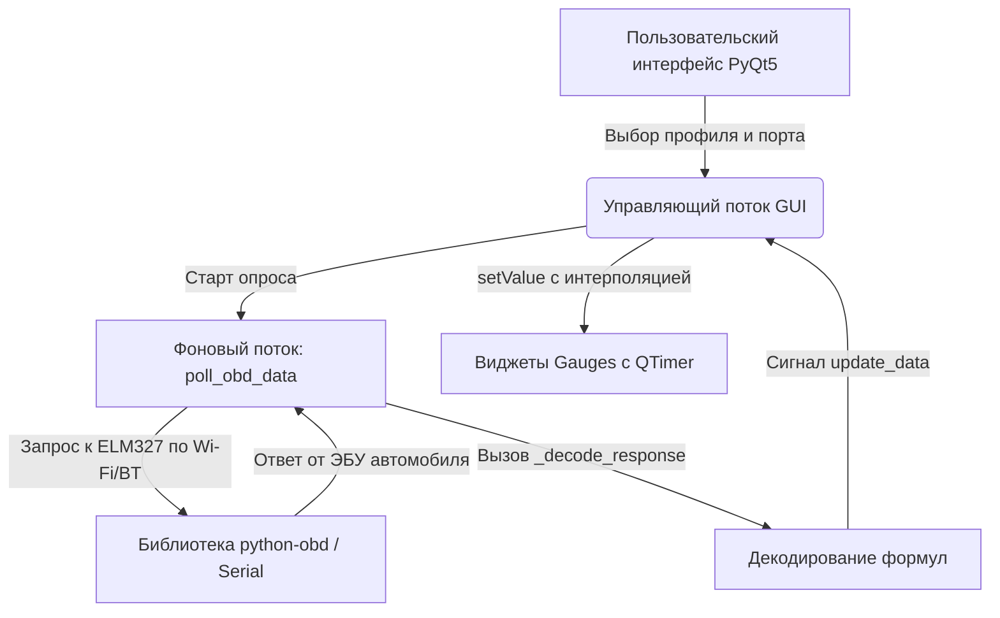

# 🚘 OBD-II ELM327 Smart Dashboard

> **Напутствие потомкам:** Этот репозиторий — плод борьбы с капризным китайским железом ELM327 и устаревшими графическими библиотеками macOS. Если вы читаете это, значит, перед вами стоит задача подружить Python с бортовым компьютером автомобиля (ЭБУ) по протоколу OBD-II или низкоуровневым UDS-запросам. Ниже изложены все знания, архитектурные решения и подводные камни, собранные воедино. Берегите этот код.

---

## 🌟 Описание проекта
Приложение предназначено для реального времени считывания параметров работы автомобиля через адаптер ELM327 (Wi-Fi / Bluetooth), подключенный в разъем OBD-II. 

**✨ Ключевые возможности программы:**
* **Двойной профиль автомобиля (Vehicle Profiles):**
  * **Audi E-tron / VAG EV**: Профиль для электромобилей. Запросы идут через низкоуровневый протокол **UDS Service 0x22 (Read Data By Identifier)**.
  * **Mercedes Sprinter / Standard ICE**: Профиль для автомобилей с ДВС. Запросы идут через **Standard OBD-II PIDs (Mode 01)**.
* **Премиальный UI на PyQt5:**
  * **Аппаратная отрисовка (`QPainter`):** Круговые и линейные шкалы с неоновым свечением.
  * **Сглаженный Glow-эффект:** Эффект свечения прорисовывается за 15 микрошагов (по 2px) с квадратичным угасанием альфа-канала, имитируя мягкое аналоговое размытие.
  * **Плавная анимация приборов:** Стрелки и индикаторы скользят плавно благодаря интерполяции кадров, убирая "дерганье" при низком темпе опроса OBD.
* **Запись телеметрии (CSV Logger):** Фоновое логирование показателей в CSV-файл для последующего анализа.
* **Считывание ошибок (DTC Scanner):** Опрос памяти ошибок ЭБУ (Mode 03 / UDS) с записью в файл отчета.
* **Demo Simulator:** Встроенный программный симулятор автомобиля для отладки UI без подключения к реальной машине.

---

## 🔄 Недавние важные обновления и исправления

1. **Исправление формулы декодирования скорости (UDS F40D):**
   * **Проблема:** Ранее для стандартной скорости, проброшенной через UDS (DID `F40D`), ошибочно применялась формула от Audi Speed (DID `0281`), из-за чего реальная скорость умножалась примерно на 2.56 (например, вместо 1, 2, 3 км/ч на парковке выводилось 2.6, 5.1, 7.7 км/ч).
   * **Решение:** Добавлено строгое разветвление по байтам DID. Если скорость получена по `F40D`, программа считывает чистый первый байт payload напрямую (`1 байт = 1 км/ч`).
2. **Устранение зависания / краша интерфейса при запуске:**
   * **Проблема:** Переключение интерфейса в режим Bluetooth происходило до того, как в конструкторе `init_ui` были инициализированы виджеты полей ввода портов, что вызывало `AttributeError: 'OBDDashboardQT' object has no attribute 'port_label'`.
   * **Решение:** Сигнал автовыбора режима перенесен в самый конец функции инициализации интерфейса, когда все GUI-компоненты гарантированно созданы.
3. **Плавная 60 FPS анимация приборов:**
   * **Внедрение:** В классы шкал `CircularGauge` и `LinearGauge` встроен таймер `QTimer` с частотой обновления 16 мс. Вместо мгновенного "прыжка" стрелки к новому значению, применен алгоритм экспоненциального сглаживания: `current_value += (target_value - current_value) * 0.1` на каждом кадре. Это делает анимацию плавной даже при лагах связи Bluetooth/Wi-Fi.

---

## 📊 Детальный разбор параметров и формул декодирования

Вся магия разбора сырых байт происходит в методе `_decode_response()` класса `OBDDashboardQT`. Данные поступают в формате ответа UDS (`62 [DID_H] [DID_L] [data...]`) или стандартного OBD-II (`41 [PID] [data...]`).

### 1. Профиль «Audi E-tron / VAG EV» (Электромобиль)

| Название прибора | Запрашиваемый ID (DID) | Декодирование байт (Payload) | Физический смысл и формула | Куда выводится в GUI |
| :--- | :--- | :--- | :--- | :--- |
| **Скорость (Speed)** | `F40D` (стандарт) или `0281` (проприетарный) | Если `F40D`: `payload[0]`<br>Если `0281`: `(payload[0] * 256 + payload[1]) / 100.0` | Скорость автомобиля в км/ч. | **Центральный круглый прибор** (в центре выводятся крупные цифры скорости, шкала заполняется по кругу). |
| **Заряд батареи (SOC)** | `028C` | `payload[0]` (если <= 100) или `payload[0] * 100.0 / 255.0` | Уровень заряда высоковольтной батареи в %. | **Правый круглый прибор** (зеленый полукруг). |
| **Напряжение (Voltage)** | `1E3B` | `(payload[0] * 256 + payload[1]) / 10.0` | Напряжение высоковольтной батареи в Вольтах (обычно около 350-450 В). | Используется фоном для расчета мощности. |
| **Ток (Current)** | `1E3D` | `payload[0] * 65536 + payload[1] * 256 + payload[2]` | Сила тока в амперах. Рассчитывается со смещением: `amps = (raw - 150000.0) / 100.0`. <br>• `150000` = 0 А (покой).<br>• `< 150000` = разряд (потребление).<br>• `> 150000` = заряд (рекуперация). | Используется фоном для расчета мощности. |
| **Мощность (Power)** | *Вычисляемый параметр* | `- (Voltage * amps) / 1000.0` | Мгновенная мощность в кВт. <br>• **Положительная** (разгон).<br>• **Отрицательная** (рекуперация). | **Левый круглый прибор** (вместо тахометра). Цвет меняется динамически: голубой (рекуперация), белый/зеленый (покой), оранжево-красный (активный разгон). |
| **Температура (Temp)** | `1EB1` | `payload[0] - 100.0` | Температура тяговой батареи в °C. | **Вертикальный линейный термометр** справа. |

---

### 2. Профиль «Mercedes Sprinter / Standard ICE» (ДВС)

| Название прибора | Запрашиваемый PID (Mode 01) | Декодирование байт (Payload) | Физический смысл и формула | Куда выводится в GUI |
| :--- | :--- | :--- | :--- | :--- |
| **Скорость (Speed)** | `0D` | Читается библиотекой `python-obd` напрямую | Скорость в км/ч. | **Центральный круглый прибор** (цифры скорости). |
| **Обороты двигателя (RPM)** | `0C` | `((payload[0] * 256) + payload[1]) / 4.0` | Частота вращения коленвала в об/мин. | **Левый круглый прибор** (тахометр). Шкала динамически подсвечивается: >3000 об/мин — оранжевый, >4500 об/мин — красный (красная зона). |
| **Температура двигателя** | `05` | `payload[0] - 40.0` | Температура охлаждающей жидкости (антифриза) в °C. | **Вертикальный линейный термометр** справа. |
| **Вольтаж бортовой сети** | `42` | `(payload[0] * 256 + payload[1]) / 1000.0` | Напряжение бортовой сети 12В/24В автомобиля в Вольтах. | **Правый круглый прибор** (вместо SOC выводятся Вольты бортовой сети). |

---

## 🛠 Структура и логика кода для разработчиков

Основной рабочий файл — `obd_gui_qt.py`. Код разделен на несколько логических слоев:



### Главные классы и методы:
* **`CircularGauge(QWidget)`** — кастомный полукруглый/круговой прибор. Рисует шкалу с помощью `QPainter`. Внутри содержит `QTimer`, который каждые 16мс постепенно подтягивает стрелку к целевому значению.
* **`LinearGauge(QWidget)`** — вертикальный градусник температуры. Также использует интерполяционный `QTimer` для плавного заполнения шкалы.
* **`OBDDashboardQT(QMainWindow)`** — основное окно. 
  * `init_ui()` — создает сетку виджетов, сайдбар настроек, подключает события.
  * `toggle_connection()` — запускает/останавливает соединение. Создает отдельный поток `polling_thread` для работы с OBD-портом (чтобы интерфейс приложения не зависал при ожидании ответов от адаптера).
  * `poll_obd_data()` — цикл опроса в фоновом потоке. В зависимости от профиля шлет либо `connection.query(...)` (стандартный OBD), либо `self.send_uds_raw(...)` (для UDS).
  * `_test_bt_raw()` — функция-диагност для Bluetooth. До запуска основной библиотеки проверяет, отвечает ли адаптер на базовую команду перезагрузки `ATZ`. Если на Mac устройство не сконфигурировано или порт занят, выдает человекочитаемую ошибку.

---

## 🔌 Особенности работы с адаптерами ELM327

### Поддерживаемое оборудование:
1. **Kingbolen OBD SCAN V1.5 (Bluetooth)**:
   * Скорость обмена (Baudrate): **9600 bps** (опция в интерфейсе `"9600 (Kingbolen V1.5)"`).
   * Самый стабильный вариант для недорогих Bluetooth-свистков.
2. **Стандартные ELM327 Bluetooth / Wi-Fi**:
   * Скорость обмена: **38400 bps** или **115200 bps** (по умолчанию для чипов v2+).
   * Wi-Fi адаптеры обычно работают по протоколу TCP на адресе `192.168.0.10:35000`.
3. **Эмулятор (`elm_emulator.py`)**:
   * Имитирует ответы ELM327 на виртуальном COM-порту. Автоматически реагирует на запросы UDS (VAG EV) и стандартные PIDs, позволяя отлаживать программу дома.

### ⚠️ Важные нюансы для ОС:
* **macOS и Bluetooth:** При сопряжении адаптера с Mac используйте порт `/dev/cu.OBDII`. Порты с префиксом `/dev/tty.*` требуют сигнала DCD и будут вызывать глухое зависание программы при попытке открыть порт.
* **Таймауты:** Для Bluetooth таймаут ожидания ответа увеличен до `8.0` сек, чтобы компенсировать задержки беспроводного канала.

---

## 📦 Сборка в один исполняемый файл (.exe / .app)

Для компиляции проекта в один файл, не требующий установленного Python на целевом компьютере, используется утилита **PyInstaller**.

### Инструкция для Windows:
1. Откройте терминал (PowerShell или CMD) в папке проекта.
2. Обновите PyInstaller до последней версии (особенно важно для совместимости с Python 3.13):
   ```bash
   pip install --upgrade pyinstaller
   ```
3. Запустите компиляцию:
   ```bash
   pyinstaller --noconsole --onefile --clean --name "OBD_Dashboard" obd_gui_qt.py
   ```
4. Готовый файл `OBD_Dashboard.exe` будет находиться в созданной папке `dist/`.

### Инструкция для macOS:
1. Откройте Терминал в папке проекта и запустите:
   ```bash
   pyinstaller --noconsole --onefile --clean --name "OBD_Dashboard" obd_gui_qt.py
   ```
2. Готовое приложение `OBD_Dashboard.app` (или исполняемый Unix-файл) будет создано в папке `dist/`.

---

## 🔮 Инструкция по добавлению новых параметров

Если в будущем вам понадобится добавить новый параметр (например, уровень масла или давление в шинах):
1. **Для EV (UDS):** найдите HEX-идентификатор параметра (DID). Добавьте его в список тестирования в `poll_obd_data` и пропишите формулу разбора байт в `_decode_response()`.
2. **Для ДВС (OBD-II):** проверьте поддержку PID в стандарте SAE J1979. Если PID стандартный, импортируйте его из `obd.commands` и сделайте запрос `self.connection.query(obd.commands.YOUR_COMMAND)`.
3. **Обновление GUI:** отправьте полученное значение через сигнал `self.signals.update_data.emit(...)` в главный поток интерфейса и вызовите метод `setValue()` у соответствующего прибора.

*Пусть код работает без сбоев, а коннект всегда будет стабильным!*
